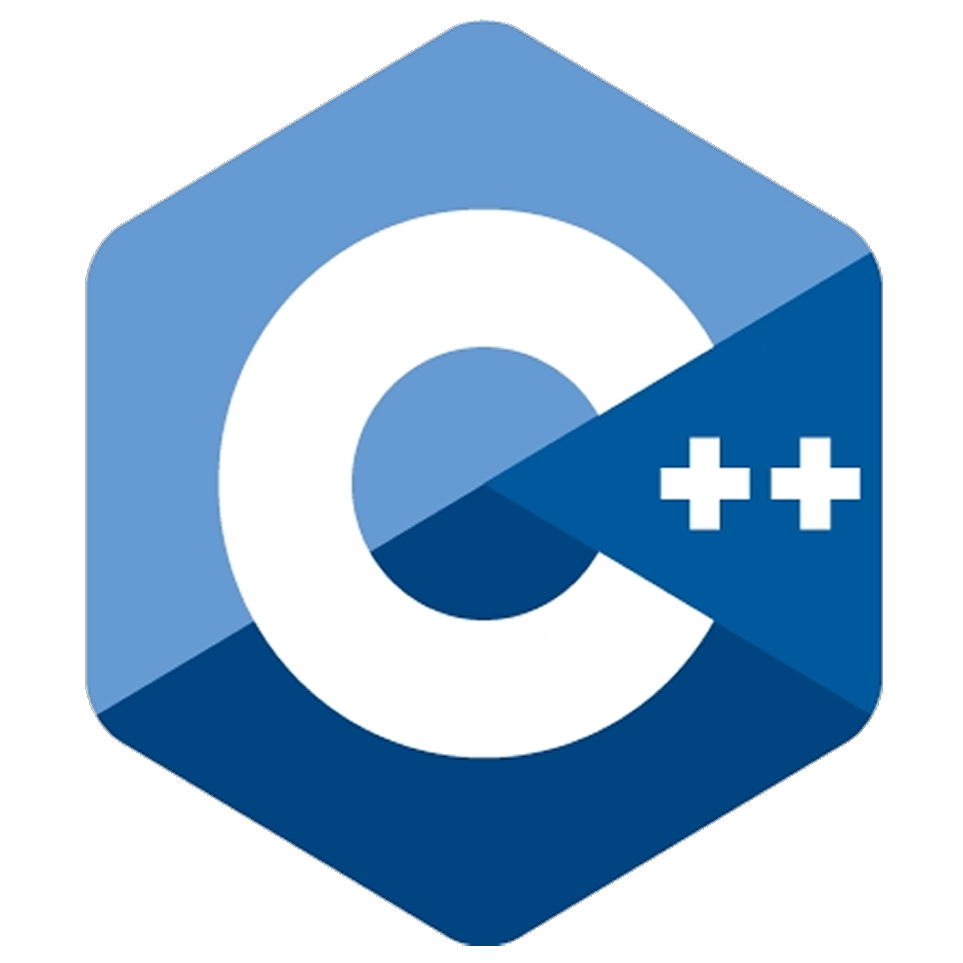
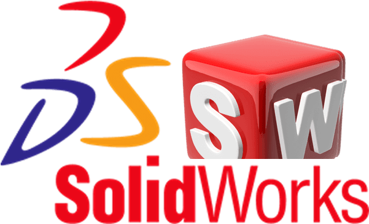

# 🎯 About me
- :hong_kong: Born and raised in Hong Kong 
- 2️⃣ Year 2 
- ⚡ Electric Engineering 
- 🏫 HKUST 
- 🗣️ English, Cantonese, Mandarin 
- 🟠 Favourite color: orange 
- 🧠 mbti: istj 

# 🌟 Experiences
- 🧑‍🔧 24-25: Member of HKUST RoboMaster team Enterprise as mechanic
- ~~😭 Hire me for more...~~

# 💻 Technical Skills 

| **Advanced** | **Intermediate** | **Beginner** |
|:-:|:-:|:-:|
|  |  |  
|  |  |  | 
|  |  |  |
|  |  |  |

# 💡 My Projects
- 🔢 [Simple Counter (python)](https://github.com/LYL8962/Simple-Counter)
- 🖱️ [Auto Clicker (python, working in progress)](https://github.com/LYL8962/Auto-Clicker)

# 🤩 My Hobbies
- 🚚 Driving 🅿️
- 🖥️ Programming
- 🎮 Gaming

# 📩 Contacts

<!--
**LYL8962/LYL8962** is a ✨ _special_ ✨ repository because its `README.md` (this file) appears on your GitHub profile.
-->

